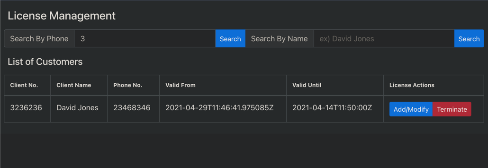

## Django-React License Management App

### A simple ORM webapp that can search and manage the clients and its license status

- Used django for back-end, sqlite3 for database,<br>
- react.js for front-end, redux for react.js status management,<br>
- react-bootstrap for user-interface.

### ``Work In Progress``



## How to run it?

Clone this repository on your computer.

```
git clone https://github.com/Kooni-Boop/Django-React_License_Management_App
```

Then, you need to run both back-end(django) and front-end(react.js) servers.
<br>If you already have Docker installed, you can type following command in root folder to skip further steps.

```
docker-compose up
```

Otherwise, type following command in ./django_project folder.

```
python3 -m pip install -r requirements.txt
python3 manage.py makemigrations
python3 manage.py migrate
python3 manage.py runserver
//On windows, you should type 'py' instead of 'python3'
```

And then go to ./web folder and run following commands to install dependencies for front-end server and run it.

```
npm i 
//this may take some time.
npm run start
```

Then your browser should have created a new tab with the app you just started.<br>
otherwise, type following on your browser.

```
localhost:3000
```

